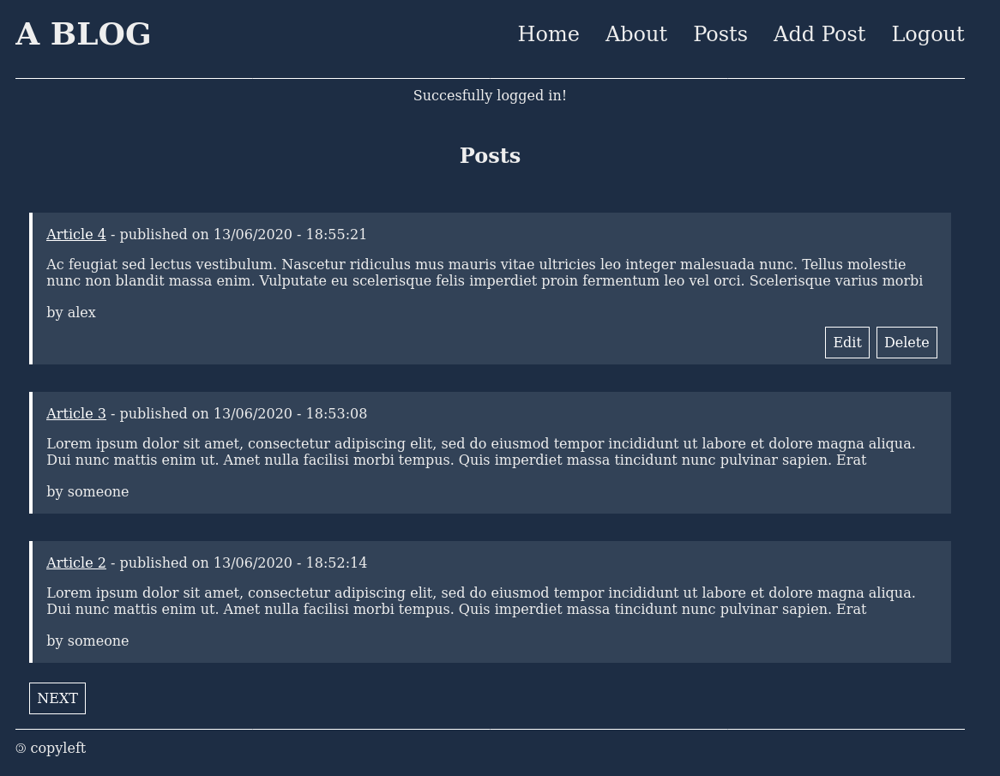
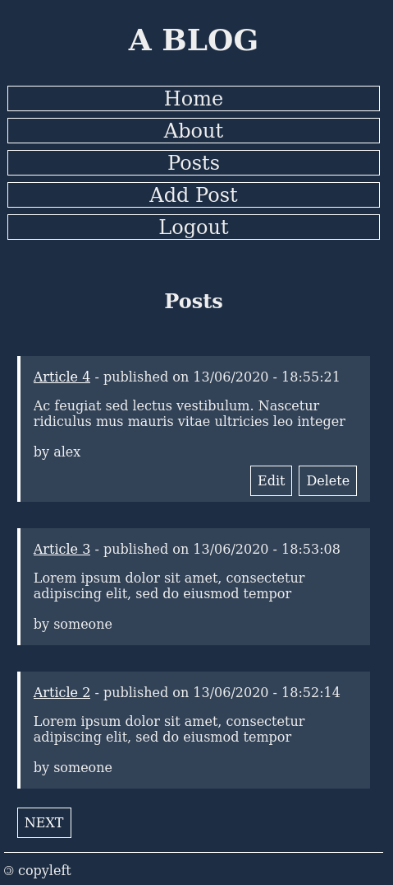

# Blog
A small blog to test some libraries as a school project.

## Built with
Python (Flask, Flask-WTF/WTForms, peewee, argon2-cffi), SQLite, HTML, CSS.

## Installation
1. Clone repository.
2. From inside a virtual environment: pip install -r requirements.txt
3. Launch Flask development server: python app.py
4. Open your browser to: localhost:5000 or 127.0.0.1:5000

## Screenshots

## Features
- Account creation.
- Read posts.
- Write, update, or delete your own posts.

## Status
In progress.
