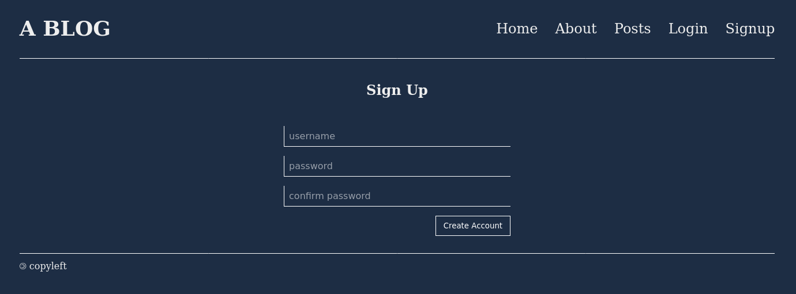
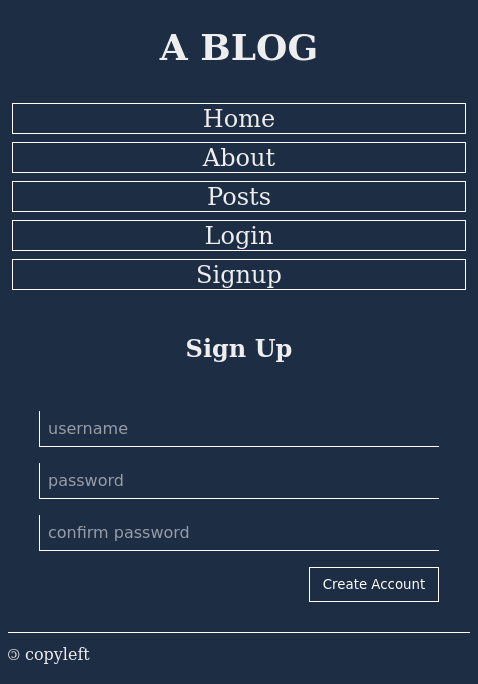

# Blog
A small blog to test some libraries as a school project.

## Built with
Python (Flask, Flask-WTF/WTForms, peewee, argon2-cffi), HTML, CSS.

## Screenshots

## Features
- Account creation.
- Read posts.
- Write, update, or delete your own posts.

## Status
In progress.
